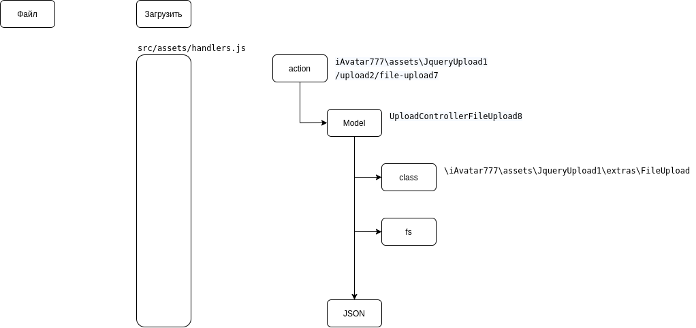

# yii2-asset-jquery-upload1

Ресурс и контроллер для Yii2 который позволяет создать загрузчик файла на сервер

Содержит контроллер и действие для обработки прогресса загрузки и сохранения файла в файловой системе.

https://www.draw.io/#G1VN37M-uP9PQ34gl28gsd-di1D7nK2Tlf



## Инсталяция

Для инсталяции библиотеки используйте composer:

```json
{
    "require": {
        "i-avatar777/yii2-asset-jquery-upload1": "*"
    }
}
```

Или через команду

```
composer require i-avatar777/yii2-asset-jquery-upload1
```

## Настройка

Файл `config.php`

```php
return [
    // ...
    'controllerMap' => [
        // ...
        'upload2' => '\iAvatar777\assets\JqueryUpload1\Upload2Controller',
    ],
];
```

Файл `params.php`

```php
return [ 
    // ...
    'widgetFileUpload7' => [
        'uploadDirectory'               => '@webroot/upload',   
        'inputName'                     => 'uploadfile',
        'Origin'                        => '*',
        'Access-Control-Allow-Origin'   => '*',
    ],
];
```

## Пример использования

```php
\iAvatar777\assets\JqueryUpload1\JqueryUpload::register($this);
```

```js
var uploader = new ss.SimpleUpload({
      button: 'upload-btn', // HTML element used as upload button
      url: '/upload2/file-upload7', // URL of server-side upload handler
      name: 'uploadfile', // Parameter name of the uploaded file
      sessionProgressUrl: '/upload2/session-progress'
});
```

## Будущие разработки

Планируется сделать чтобы в контроллере была возможность еще сразу подрезать картинку под размер или наложить маску.